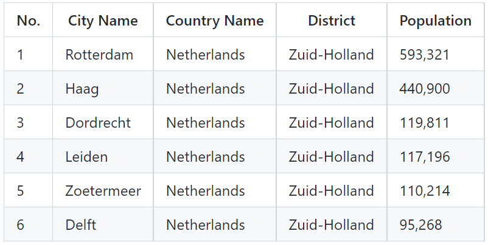
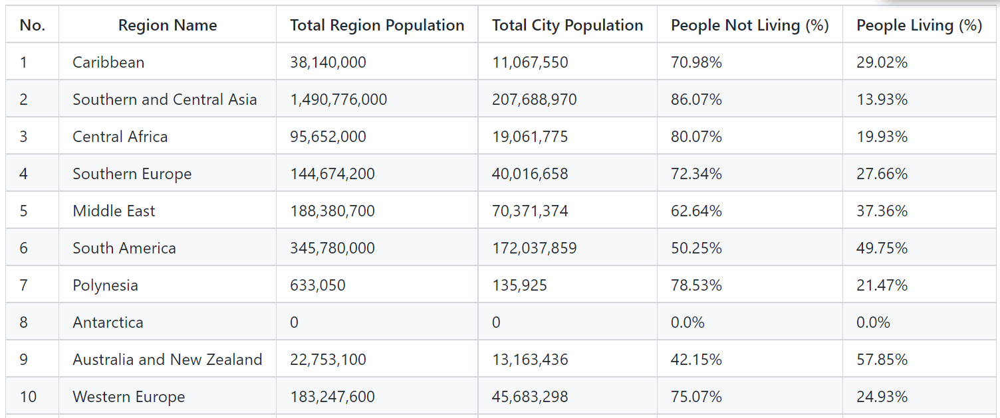
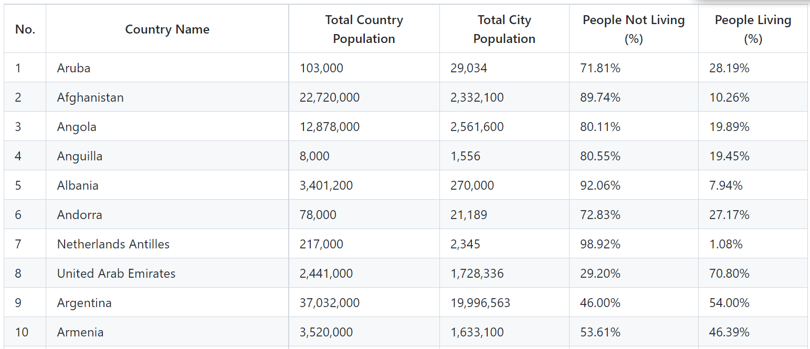
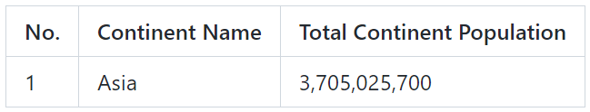

SET09623 2022-2023 TR2 001 - DevOps
--------------------------------------
# Group 4 Members

| Saw Yu Nandar (Product Owner) | Yoon Ei Shwe Zin (Scrum Master) | Su Hnin Lwin | Nang Shwe Sin Win |
|-------------------------------|---------------------------------|--------------|-------------------|
|             40516606          |               40516568          |   40516571   |       40516595    |

# Contribution Spreadsheet

|   Matric No (Team Members)   | Code Review 1  | Code Review 2 | Code Review 3 | Code Review 4 | Final Deliverable |
|------------------------------|----------------|---------------|---------------|---------------|-------------------|
| Saw Yu Nandar (40516606)     |       25       |       28      |       25      |       22      |         25        |               
| Yoon Ei Shwe Zin (40516568)  |       25       |       23      |       25      |       27      |         25        |               
| Su Hnin Lwin (40516571)      |       25       |       21      |       25      |       29      |         25        |               
| Nang Shwe Zin Win (40516595) |       25       |       28      |       25      |       22      |         25        |
|             Total            |      100       |      100      |      100      |      100      |        100        |

# Build status for master

# Build status for develop

# Code Coverage test for master
 

# Release

# License

# Requirements for Query Report have been fullfilled. 
| ID    | Name | Met  | Screenshot |
|-------|------|------|------------|
| 1     | All the countries in the world organised by largest population to smallest. | Yes |  |
| 2     | All the countries in a continent organised by largest population to smallest.| Yes |  |
| 3     | All the countries in a region organised by largest population to smallest. | Yes |  |
| 4     | The top N populated countries in the world where N is provided by the user. | Yes |  |
| 5     | The top N populated countries in a continent where N is provided by the user. | Yes |  |
| 6     | The top N populated countries in a region where N is provided by the user. | Yes |  |
| 7     | All the cities in the world organised by largest population to smallest. | Yes |  |
| 8     | All the cities in a continent organised by largest population to smallest. | Yes |  |
| 9     | All the cities in a region organised by largest population to smallest. | Yes |  |
| 10    | All the cities in a country organised by largest population to smallest. | Yes |  |
| 11    | All the cities in a district organised by largest population to smallest. | Yes |  |
| 12    | The top N populated cities in the world where N is provided by the user. | Yes |  |
| 13    | The top N populated cities in a continent where N is provided by the user. | Yes |  |
| 14    | The top N populated cities in a region where N is provided by the user. | Yes |  |
| 15    | The top N populated cities in a country where N is provided by the user. | Yes |  |
| 16    | The top N populated cities in a district where N is provided by the user. | Yes |  |
| 17    | All the capital cities in the world organised by largest population to smallest. | Yes |  |
| 18    | All the capital cities in a continent organised by largest population to smallest. | Yes |  |
| 19    | All the capital cities in a region organised by largest to smallest. | Yes |  |
| 20    | The top N populated capital cities in the world where N is provided by the user. | Yes |  |
| 21    | The top N populated capital cities in a continent where N is provided by the user. | Yes |  |
| 22    | The top N populated capital cities in a region where N is provided by the user. | Yes |  |
| 23    | The population of people, people living in cities, and people not living in cities in each continent. | Yes |  |
| 24    | The population of people, people living in cities, and people not living in cities in each region. | Yes |  |
| 25    | The population of people, people living in cities, and people not living in cities in each country. | Yes |  |
| 26    | The population of the world. | Yes |  |
| 27    | The population of a continent. | Yes |  |
| 28    | The population of a region. | Yes |  |
| 29    | The population of a country. | Yes |  |
| 30    | The population of a district. | Yes |  |
| 31    | The population of a city. | Yes |  |
| 32    | The population of people who speak Chinese, English, Hindi, Spanish or Arabic by greatest number to smallest, including the percentage of the world population. | Yes |  |

